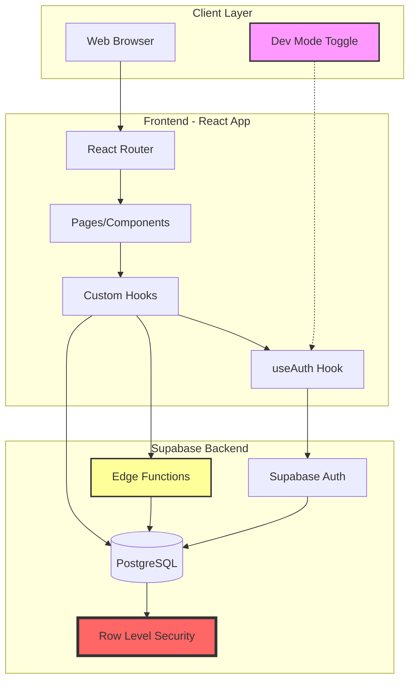
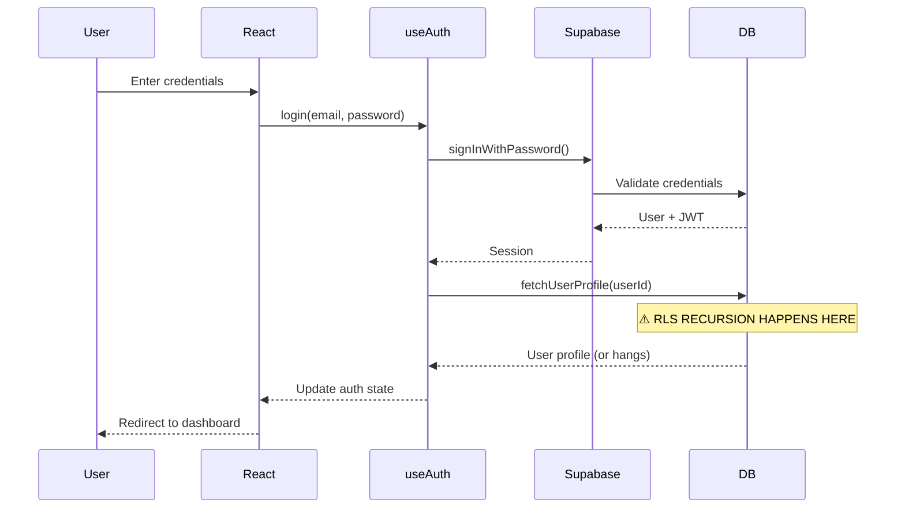
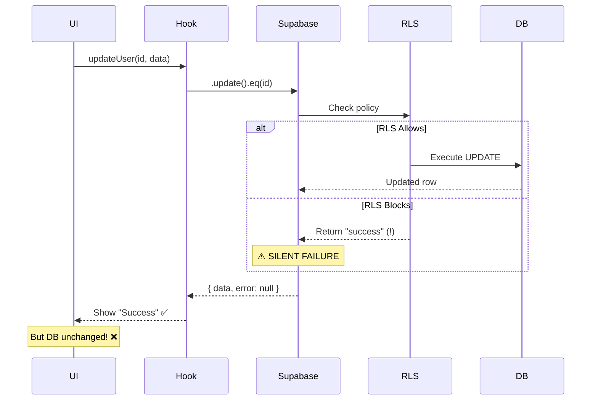
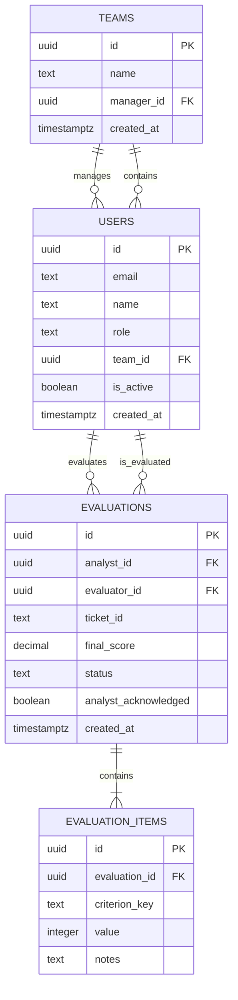

# Architecture - Screener

## Tech Stack Overview

| Layer | Technology | Version | Purpose |
|-------|------------|---------|---------|
| **Frontend** | React | 19.2.0 | UI framework |
| | Vite | 7.2.4 | Build tool & dev server |
| | TailwindCSS | 4.1.18 | Styling |
| | React Router | 7.11.0 | Client-side routing |
| | Recharts | 3.6.0 | Data visualization |
| **Backend** | Supabase | - | Backend-as-a-Service |
| | PostgreSQL | 15+ | Database |
| | Edge Functions | Deno | Serverless functions |
| **Auth** | Supabase Auth | - | JWT-based authentication |
| | Row Level Security | - | Database-level authorization |
| **Dev Tools** | ESLint | 9.39.1 | Code linting |
| | Lucide React | 0.562.0 | Icon library |

## System Architecture



## Data Flow

### Authentication Flow



### CRUD Operations Flow



## Authentication & Authorization

### Current Implementation (Problematic)

```javascript
// ❌ PROBLEM: RLS policy queries same table
CREATE POLICY "Admins can update users" ON users
  FOR UPDATE USING (
    EXISTS (SELECT 1 FROM users WHERE id = auth.uid() AND role = 'admin')
    --                    ^^^^^ Infinite recursion!
  );
```

### Recommended Implementation for 2.0

```sql
-- ✅ SOLUTION: Use SECURITY DEFINER function
CREATE OR REPLACE FUNCTION auth.is_admin()
RETURNS BOOLEAN AS $$
  SELECT EXISTS (
    SELECT 1 FROM public.users 
    WHERE id = auth.uid() AND role = 'admin'
  );
$$ LANGUAGE SQL SECURITY DEFINER;

-- Policy uses function (no recursion)
CREATE POLICY "Admins can update users" ON users
  FOR UPDATE USING (auth.is_admin());
```

## Database Schema



## Key Design Decisions

| Decision | Rationale | Trade-offs |
|----------|-----------|------------|
| **Supabase over custom backend** | Faster development, built-in auth, RLS | Less control, vendor lock-in |
| **Row Level Security** | Database-level security, can't be bypassed | Complex to debug, recursion issues |
| **Edge Functions for user management** | Secure, server-side validation | Harder to debug than REST API |
| **sessionStorage over localStorage** | Auto-clears stale data | Users must re-login after browser close |
| **Soft delete for users** | Preserves historical data | Requires `is_active` checks everywhere |
| **Dev Mode Toggle** | Fast role switching for testing | Only works in development |

## Scalability Considerations

### Current Limits
- **Users**: \u003c 500 (RLS performance degrades beyond this)
- **Evaluations**: \u003c 10,000/month (no pagination implemented)
- **Concurrent Users**: \u003c 50 (no load testing done)

### Bottlenecks
1. **RLS Policy Evaluation**: Every query checks policies (slow with complex rules)
2. **No Caching**: Every page load fetches fresh data
3. **No Pagination**: Dashboard loads all evaluations

### Scaling Strategy for 2.0
1. Simplify RLS policies (use indexed columns)
2. Add Redis caching layer
3. Implement pagination (20 items/page)
4. Use materialized views for dashboards
5. CDN for static assets

## Security Model

### Layers of Security

```
┌─────────────────────────────────────┐
│  1. Frontend (UX only, not trusted) │
├─────────────────────────────────────┤
│  2. Supabase Auth (JWT validation)  │
├─────────────────────────────────────┤
│  3. Edge Functions (business logic) │
├─────────────────────────────────────┤
│  4. Row Level Security (data access)│  ← CRITICAL LAYER
├─────────────────────────────────────┤
│  5. PostgreSQL (storage)            │
└─────────────────────────────────────┘
```

### Current Security Issues

> [!CAUTION]
> **Critical Security Gaps**:
> 1. RLS policies simplified to `auth.uid() IS NOT NULL` (bypasses role checks)
> 2. No rate limiting on Edge Functions
> 3. No audit logging for sensitive operations
> 4. sessionStorage = no persistent sessions (security vs UX trade-off)

---

*For implementation details, see [Key Components](./04_KEY_COMPONENTS.md)*  
*For critical mistakes to avoid, see [Lessons Learned](./06_LESSONS_LEARNED.md)*
