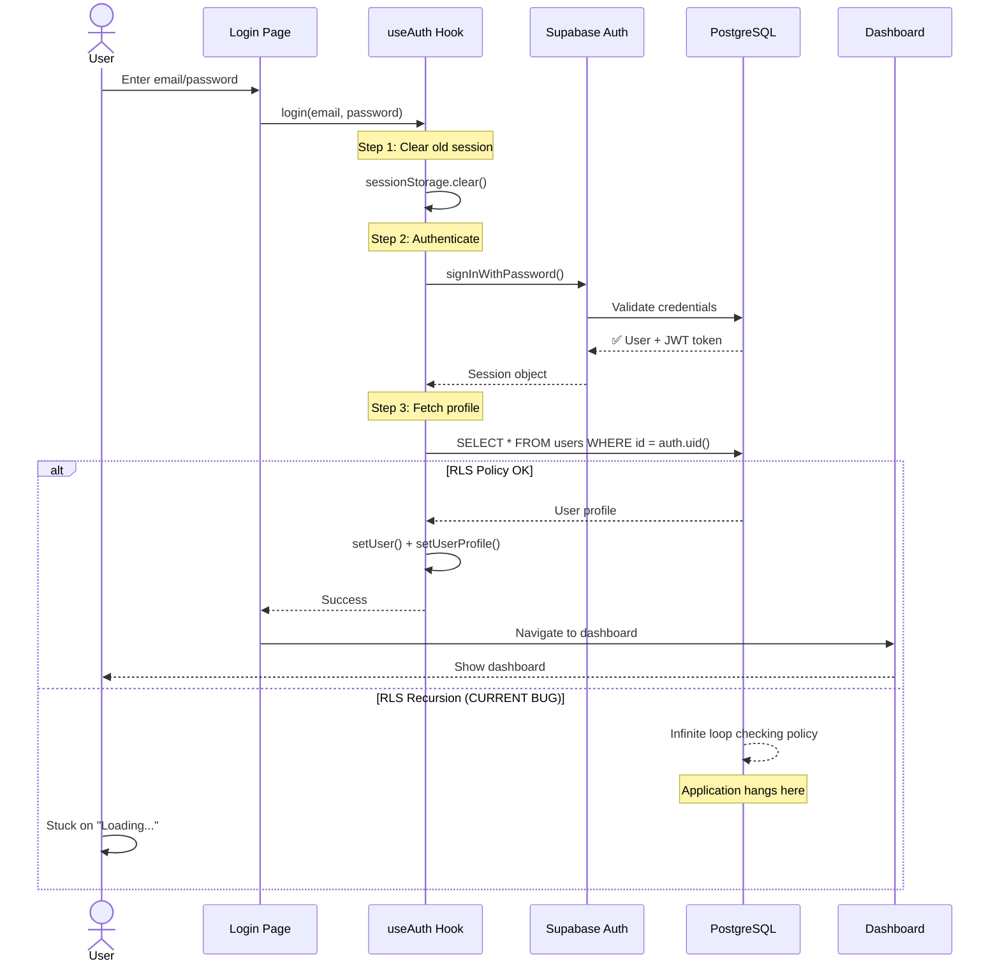
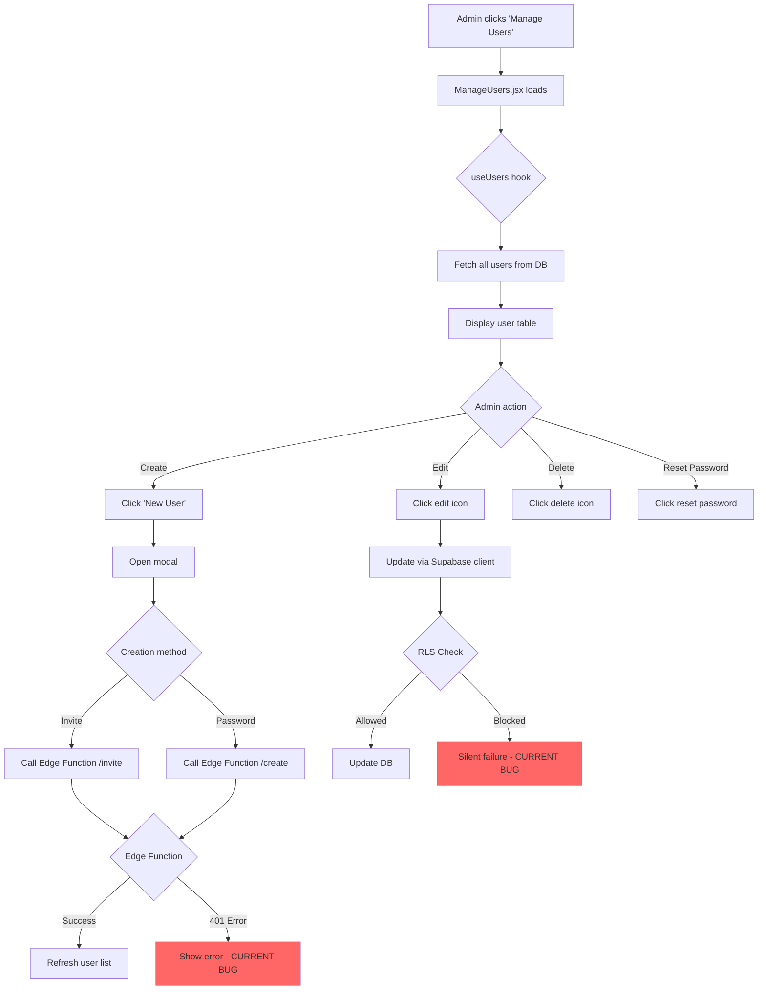
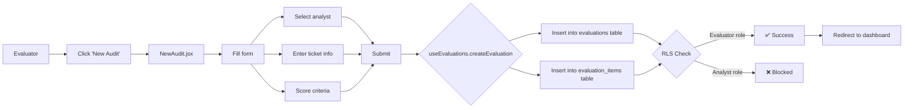

# Key Components - Screener

## Critical User Flows

### 1. Authentication Flow (Complete Journey)



**Code Location**: [`src/hooks/useAuth.jsx`](file:///d:/AntiGravity/Projetos/Screener/screener-app/src/hooks/useAuth.jsx)

**Key Functions**:
```javascript
// Line 149-171: Login function
const login = async (email, password) => {
  // 1. Clear old session data
  const oldKeys = Object.keys(sessionStorage).filter(k => k.includes('supabase'))
  oldKeys.forEach(key => sessionStorage.removeItem(key))
  
  // 2. Authenticate with Supabase
  const { data, error } = await signIn(email, password)
  
  if (error) {
    console.error('❌ [LOGIN] Login failed:', error.message)
    return { data, error }
  }
  
  // 3. Session created successfully
  console.log('✅ [LOGIN] Login successful')
  return { data, error }
}
```

**Where to Apply RLS Fix**:
```sql
-- File: supabase/05_rls_policies.sql (or new migration)
-- Replace lines 53-56 with:

DROP POLICY IF EXISTS "Admins can update users" ON users;

-- Create helper function first
CREATE OR REPLACE FUNCTION auth.is_admin()
RETURNS BOOLEAN AS $$
  SELECT EXISTS (
    SELECT 1 FROM public.users 
    WHERE id = auth.uid() AND role = 'admin'
  );
$$ LANGUAGE SQL SECURITY DEFINER;

-- Then use it in policy
CREATE POLICY "Admins can update users" ON users
  FOR UPDATE 
  USING (auth.is_admin())
  WITH CHECK (auth.is_admin());
```

---

### 2. User Management Flow (Admin)



**Code Location**: [`src/pages/ManageUsers.jsx`](file:///d:/AntiGravity/Projetos/Screener/screener-app/src/pages/ManageUsers.jsx)

**Key Functions**:
```javascript
// Line 329-352 in src/hooks/useUsers.jsx
const updateUser = async (id, updates) => {
  // ⚠️ CURRENT ISSUE: Returns success even if RLS blocks
  const { data, error } = await supabase
    .from('users')
    .update({
      name: updates.name,
      role: updates.role,
      team_id: updates.teamId
    })
    .eq('id', id)
    .select()
    .single()
  
  // ✅ FIX: Add verification step
  // const verified = await supabase
  //   .from('users')
  //   .select('name')
  //   .eq('id', id)
  //   .single()
  // 
  // if (verified.data.name !== updates.name) {
  //   throw new Error('Update blocked by RLS')
  // }
  
  return data
}
```

---

### 3. Evaluation Creation Flow



**Code Location**: [`src/pages/NewAudit.jsx`](file:///d:/AntiGravity/Projetos/Screener/screener-app/src/pages/NewAudit.jsx)

**RLS Policy**:
```sql
-- File: supabase/05_rls_policies.sql, lines 145-148
CREATE POLICY "Evaluators can create evaluations" ON evaluations
  FOR INSERT WITH CHECK (
    EXISTS (SELECT 1 FROM users WHERE id = auth.uid() AND role IN ('evaluator', 'admin'))
  );
```

**Where to Apply Fix**:
```sql
-- Replace with SECURITY DEFINER function
CREATE OR REPLACE FUNCTION auth.can_create_evaluation()
RETURNS BOOLEAN AS $$
  SELECT EXISTS (
    SELECT 1 FROM public.users 
    WHERE id = auth.uid() AND role IN ('evaluator', 'admin')
  );
$$ LANGUAGE SQL SECURITY DEFINER;

CREATE POLICY "Evaluators can create evaluations" ON evaluations
  FOR INSERT WITH CHECK (auth.can_create_evaluation());
```

---

## Complex Components Deep Dive

### Component: DevModeToggle

**Purpose**: Development tool for instant role switching without logout

**File**: [`src/components/DevModeToggle.jsx`](file:///d:/AntiGravity/Projetos/Screener/screener-app/src/components/DevModeToggle.jsx)

**How It Works**:
```javascript
// Lines 63-86: Profile selection with real authentication
const handleProfileSelect = async (profile) => {
  try {
    // Attempts REAL Supabase login (not mock)
    const { data, error } = await supabase.auth.signInWithPassword({
      email: profile.email,
      password: profile.password  // Hardcoded test passwords
    })

    if (error) {
      // Offers fallback to Mock Mode
      const useMock = window.confirm(
        `Real login failed: ${error.message}\n\nUse Mock Mode instead?`
      )
      
      if (useMock) {
        onProfileChange(profile)  // Sets fake profile for UI testing
      }
    } else {
      onProfileChange(profile)  // Real authenticated session
    }
  } catch (err) {
    console.error('Unexpected error:', err)
  }
}
```

**Gotchas**:
- Mock Mode doesn't work with Edge Functions (no real JWT)
- Passwords must match database (use `16_reset_test_passwords.sql`)
- Only available in development mode (`import.meta.env.DEV`)

---

### Component: useAuth Hook

**Purpose**: Central authentication state management

**File**: [`src/hooks/useAuth.jsx`](file:///d:/AntiGravity/Projetos/Screener/screener-app/src/hooks/useAuth.jsx)

**State Management**:
```javascript
const [user, setUser] = useState(null)           // Supabase auth user
const [userProfile, setUserProfile] = useState(null)  // Database user record
const [loading, setLoading] = useState(true)     // Auth initialization
const [devProfile, setDevProfile] = useState(null)    // Dev Mode override
```

**Critical Function - fetchUserProfile**:
```javascript
// Lines 119-144: WHERE THE RLS RECURSION HAPPENS
const fetchUserProfile = async (userId) => {
  try {
    // ⚠️ This query triggers RLS policy
    // RLS policy checks: "Is user admin?"
    // To check, it queries: SELECT role FROM users WHERE id = auth.uid()
    // This triggers the SAME RLS policy again → INFINITE LOOP
    const { data, error } = await supabase
      .from('users')
      .select('*')
      .eq('id', userId)
      .single()

    if (error) throw error
    setUserProfile(data)
  } catch (error) {
    console.error('[Auth] Profile fetch failed:', error.message)
    setUserProfile(null)
    throw error
  }
}
```

**Fix Location**: Apply RLS fix in `supabase/05_rls_policies.sql` (see Authentication Flow above)

---

## API Endpoints (Edge Functions)

### POST `/functions/v1/manage-users`

**Purpose**: Create user with password

**File**: [`supabase/functions/manage-users/index.ts`](file:///d:/AntiGravity/Projetos/Screener/screener-app/supabase/functions/manage-users/index.ts)

**Request**:
```json
{
  "name": "John Doe",
  "email": "john@example.com",
  "password": "SecurePass123",
  "role": "analyst",
  "teamId": "uuid-here",
  "method": "password"
}
```

**Current Implementation (PROBLEMATIC)**:
```typescript
// Lines 74-89: Manual JWT extraction (FAILS)
const authHeader = req.headers.get('authorization')
const token = authHeader?.replace('Bearer ', '')

const { data: { user }, error } = await supabaseAdmin.auth.getUser(token)
// ❌ Returns "Invalid JWT" error
```

**Correct Implementation**:
```typescript
// ✅ Let Supabase handle JWT automatically
const supabase = createClient(
  Deno.env.get('SUPABASE_URL')!,
  Deno.env.get('SUPABASE_ANON_KEY')!,
  {
    global: {
      headers: { Authorization: req.headers.get('Authorization')! }
    }
  }
)

const { data: { user }, error } = await supabase.auth.getUser()
// ✅ Works correctly
```

**Where to Apply**: Replace lines 74-89 in `supabase/functions/manage-users/index.ts`

---

## Database Schema Details

### Table: `users`

```sql
CREATE TABLE users (
  id UUID PRIMARY KEY REFERENCES auth.users(id),
  email TEXT NOT NULL,
  name TEXT NOT NULL,
  role TEXT NOT NULL CHECK (role IN ('admin', 'evaluator', 'analyst')),
  team_id UUID REFERENCES teams(id),
  is_active BOOLEAN DEFAULT TRUE,
  created_at TIMESTAMPTZ DEFAULT NOW()
);
```

**Indexes**:
```sql
CREATE INDEX idx_users_team ON users(team_id);
CREATE INDEX idx_users_role ON users(role);
```

**RLS Policies** (Current - PROBLEMATIC):
```sql
-- ❌ CAUSES RECURSION
CREATE POLICY "Admins can update users" ON users
  FOR UPDATE USING (
    EXISTS (SELECT 1 FROM users WHERE id = auth.uid() AND role = 'admin')
  );
```

---

## Performance Considerations

### Slow Queries

**Problem**: Dashboard loads all evaluations without pagination

**File**: [`src/hooks/useEvaluations.jsx`](file:///d:/AntiGravity/Projetos/Screener/screener-app/src/hooks/useEvaluations.jsx)

```javascript
// Current: Loads ALL evaluations
const { data } = await supabase
  .from('evaluations')
  .select('*')
  .order('created_at', { ascending: false })

// ✅ Fix: Add pagination
const { data } = await supabase
  .from('evaluations')
  .select('*')
  .order('created_at', { ascending: false })
  .range(0, 19)  // First 20 items
```

---

*For deployment instructions, see [Deployment Guide](./07_DEPLOYMENT.md)*  
*For dependency details, see [Dependencies](./05_DEPENDENCIES.md)*
