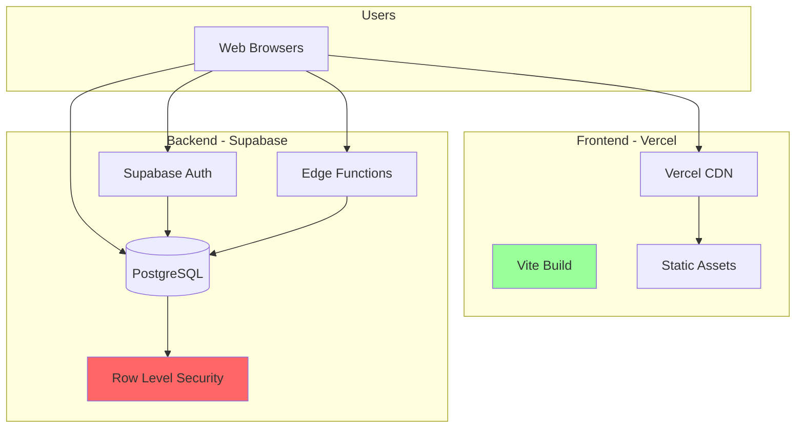

# Deployment Guide - Screener

> [!CAUTION]
> **DO NOT DEPLOY CURRENT VERSION TO PRODUCTION**  
> Critical blockers must be fixed first. See [Lessons Learned](./06_LESSONS_LEARNED.md) for required fixes.

## Pre-Deployment Checklist

### Critical Fixes Required

- [ ] **Fix RLS Recursion** - Implement `SECURITY DEFINER` functions
- [ ] **Fix User Update Persistence** - Add verification layer
- [ ] **Fix Edge Function JWT** - Use native Supabase validation
- [ ] **Add Automated Tests** - RLS policy test suite
- [ ] **Switch to localStorage** - For production (with cache invalidation)

**Estimated Time**: 6-7 days

**Status**: 🔴 **NOT READY FOR PRODUCTION**

---

## Deployment Architecture



---

## Environment Setup

### Development

```bash
# .env.development
VITE_SUPABASE_URL=https://your-dev-project.supabase.co
VITE_SUPABASE_ANON_KEY=your-dev-anon-key
VITE_SUPABASE_SERVICE_ROLE_KEY=your-dev-service-key  # DEV ONLY
```

### Production

```bash
# .env.production (Vercel Environment Variables)
VITE_SUPABASE_URL=https://your-prod-project.supabase.co
VITE_SUPABASE_ANON_KEY=your-prod-anon-key
# DO NOT include service role key in production frontend!
```

---

## Frontend Deployment (Vercel)

### Initial Setup

1. **Connect Repository**
   ```bash
   # Push to GitHub
   git remote add origin https://github.com/your-org/screener.git
   git push -u origin main
   ```

2. **Import to Vercel**
   - Go to [vercel.com](https://vercel.com)
   - Click "New Project"
   - Import from GitHub
   - Select `screener-app` repository

3. **Configure Build Settings**
   - **Framework Preset**: Vite
   - **Root Directory**: `screener-app`
   - **Build Command**: `npm run build`
   - **Output Directory**: `dist`

4. **Add Environment Variables**
   - `VITE_SUPABASE_URL`: Your production Supabase URL
   - `VITE_SUPABASE_ANON_KEY`: Your production anon key

5. **Deploy**
   - Click "Deploy"
   - Wait ~2 minutes
   - Get production URL: `https://screener-app.vercel.app`

### Continuous Deployment

Every push to `main` branch triggers automatic deployment:

```bash
git add .
git commit -m "feat: add new feature"
git push origin main
# Vercel automatically deploys
```

---

## Backend Deployment (Supabase)

### Database Migrations

#### Option A: Via Supabase Dashboard (Recommended)

1. Go to Supabase Dashboard → SQL Editor
2. Run migrations in order:
   ```
   schema.sql
   04_create_test_users.sql  (skip in production)
   05_rls_policies.sql       (AFTER FIXING RECURSION)
   10_teams_evolution.sql
   12_bulk_user_helpers.sql
   13_users_soft_delete.sql
   ```

3. **Skip debugging scripts** (14-22)

#### Option B: Via Supabase CLI

```bash
# Install CLI
npm install -g supabase

# Login
supabase login

# Link project
supabase link --project-ref your-prod-project-ref

# Push migrations
supabase db push
```

### Edge Functions Deployment

```bash
# Deploy manage-users function
supabase functions deploy manage-users

# Verify deployment
supabase functions list
```

**Environment Variables for Edge Functions**:
```bash
# Set in Supabase Dashboard → Edge Functions → Secrets
SUPABASE_URL=https://your-project.supabase.co
SUPABASE_SERVICE_ROLE_KEY=your-service-role-key
```

---

## Post-Deployment Verification

### Smoke Tests

Run these tests after deployment:

```bash
# 1. Frontend loads
curl https://screener-app.vercel.app
# Expected: HTML response

# 2. API connectivity
curl https://your-project.supabase.co/rest/v1/
# Expected: 200 OK

# 3. Edge Function
curl -X POST https://your-project.supabase.co/functions/v1/manage-users \
  -H "Authorization: Bearer YOUR_JWT" \
  -H "Content-Type: application/json"
# Expected: 401 or valid response (not 500)
```

### Manual Testing Checklist

- [ ] Login with real user
- [ ] Navigate to Dashboard
- [ ] Create new evaluation
- [ ] View evaluation details
- [ ] Logout
- [ ] Login as different role
- [ ] Verify role-based access

---

## Monitoring & Logging

### Vercel Analytics

Enable in Vercel Dashboard:
- **Analytics**: Track page views, performance
- **Speed Insights**: Core Web Vitals

### Supabase Monitoring

Dashboard → Logs:
- **Database Logs**: Query performance, errors
- **Edge Function Logs**: Execution logs, errors
- **Auth Logs**: Login attempts, failures

### Error Tracking (Recommended)

Add Sentry for production error tracking:

```bash
npm install @sentry/react
```

```javascript
// src/main.jsx
import * as Sentry from "@sentry/react"

Sentry.init({
  dsn: "your-sentry-dsn",
  environment: import.meta.env.MODE,
  tracesSampleRate: 0.1
})
```

---

## Rollback Procedure

### Frontend Rollback (Vercel)

1. Go to Vercel Dashboard → Deployments
2. Find last working deployment
3. Click "..." → "Promote to Production"
4. Confirm rollback

**Time**: ~30 seconds

### Database Rollback (Supabase)

> [!WARNING]
> **Database rollbacks are DANGEROUS**. Always backup first.

```sql
-- 1. Backup current state
pg_dump -h your-db-host -U postgres -d postgres > backup.sql

-- 2. Rollback migration (example)
DROP TABLE IF EXISTS new_table;
ALTER TABLE old_table ADD COLUMN old_column TEXT;

-- 3. Verify
SELECT * FROM old_table LIMIT 1;
```

---

## Scaling Considerations

### Current Limits (Free Tier)

| Resource | Limit | Current Usage |
|----------|-------|---------------|
| Database Size | 500 MB | ~50 MB |
| Monthly Active Users | 50,000 | 0 (not deployed) |
| Edge Function Invocations | 500,000/month | 0 |
| Bandwidth | 5 GB | 0 |

### When to Upgrade

Upgrade to **Pro Plan** ($25/month) when:
- Database \u003e 400 MB
- MAU \u003e 40,000
- Need custom domain
- Need advanced monitoring

### Performance Optimization

Before scaling infrastructure, optimize code:

1. **Add Pagination**
   ```javascript
   // src/hooks/useEvaluations.jsx
   const { data } = await supabase
     .from('evaluations')
     .select('*')
     .range(page * 20, (page + 1) * 20 - 1)
   ```

2. **Enable Caching**
   ```javascript
   // Add React Query
   npm install @tanstack/react-query
   ```

3. **Optimize Images**
   - Use WebP format
   - Lazy load images
   - CDN for static assets

---

## Security Checklist

### Pre-Production

- [ ] Remove all `console.log` statements
- [ ] Remove service role key from frontend
- [ ] Enable HTTPS only (Vercel does this automatically)
- [ ] Set up CORS properly in Supabase
- [ ] Enable rate limiting on Edge Functions
- [ ] Add audit logging for sensitive operations
- [ ] Review all RLS policies
- [ ] Run security audit: `npm audit`

### Post-Production

- [ ] Monitor auth logs for suspicious activity
- [ ] Set up alerts for failed login attempts
- [ ] Regular database backups (Supabase does daily)
- [ ] Review access logs weekly

---

## Disaster Recovery

### Backup Strategy

**Automated** (Supabase):
- Daily database backups (retained 7 days on free tier)
- Point-in-time recovery (Pro plan only)

**Manual**:
```bash
# Weekly manual backup
pg_dump -h your-db-host -U postgres -d postgres > backup_$(date +%Y%m%d).sql

# Store in secure location (S3, Google Drive, etc.)
```

### Recovery Procedure

1. **Database Corruption**
   - Restore from Supabase automated backup
   - Or restore from manual backup: `psql -h your-db-host -U postgres -d postgres \u003c backup.sql`

2. **Frontend Issues**
   - Rollback deployment in Vercel
   - Or redeploy from known good commit

3. **Complete Outage**
   - Check Supabase status page
   - If Supabase is down, wait for recovery
   - If Vercel is down, consider alternative hosting

---

## Cost Estimation

### Monthly Costs (Production)

| Service | Plan | Cost |
|---------|------|------|
| **Vercel** | Hobby | $0 |
| **Supabase** | Free | $0 |
| **Domain** | .com | $12/year |
| **Total** | | **~$1/month** |

### At Scale (100 users)

| Service | Plan | Cost |
|---------|------|------|
| **Vercel** | Pro | $20 |
| **Supabase** | Pro | $25 |
| **Sentry** | Team | $26 |
| **Total** | | **~$71/month** |

---

## Support & Troubleshooting

### Common Production Issues

**Issue**: "Application not loading"
- Check Vercel deployment status
- Check Supabase status page
- Verify environment variables

**Issue**: "Database connection failed"
- Check Supabase URL in env vars
- Verify anon key is correct
- Check database is not paused (free tier auto-pauses after 7 days inactivity)

**Issue**: "Edge Function timeout"
- Check function logs in Supabase
- Verify function is deployed
- Check for infinite loops in function code

---

*For development setup, see [Setup Guide](./02_SETUP.md)*  
*For critical fixes required, see [Lessons Learned](./06_LESSONS_LEARNED.md)*
