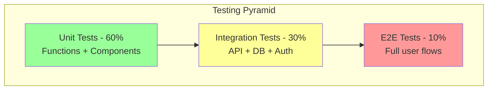
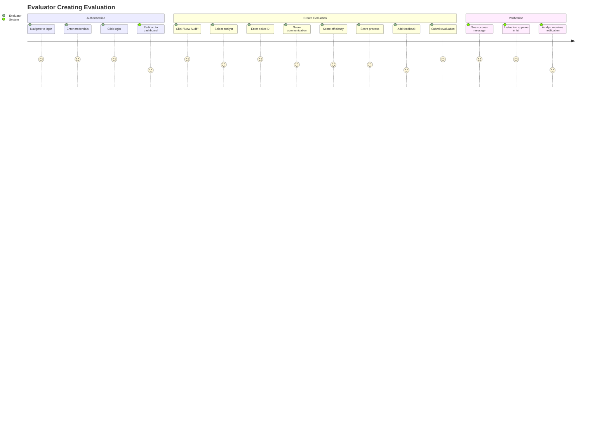

# Testing Guide - Screener

## Testing Strategy



## RLS Policy Tests (Critical)

> [!IMPORTANT]
> **RLS tests are MANDATORY before deploying 2.0**. They prevent the recursion deadlocks that blocked 1.0.

### Test Framework: pg_tap

Install in Supabase:
```sql
CREATE EXTENSION IF NOT EXISTS pgtap;
```

### Test Suite: `supabase/tests/rls_policies.sql`

```sql
-- ============================================
-- RLS POLICY TEST SUITE
-- Run with: psql -h localhost -U postgres -d postgres -f rls_policies.sql
-- ============================================

BEGIN;
SELECT plan(15);  -- Number of tests

-- ============================================
-- TEST 1: Admin can view all users
-- ============================================
SET LOCAL ROLE authenticated;
SET LOCAL request.jwt.claims TO '{"sub": "admin-user-id", "role": "authenticated"}';

-- Insert test admin
INSERT INTO users (id, email, name, role) 
VALUES ('admin-user-id', 'admin@test.com', 'Admin', 'admin');

-- Test: Admin sees all users
SELECT results_eq(
  'SELECT COUNT(*)::int FROM users',
  ARRAY[3],  -- Assuming 3 users in DB
  'Admin can view all users'
);

-- ============================================
-- TEST 2: Analyst can only view own profile
-- ============================================
SET LOCAL request.jwt.claims TO '{"sub": "analyst-user-id", "role": "authenticated"}';

INSERT INTO users (id, email, name, role) 
VALUES ('analyst-user-id', 'analyst@test.com', 'Analyst', 'analyst');

-- Test: Analyst sees only themselves
SELECT results_eq(
  'SELECT COUNT(*)::int FROM users WHERE id = auth.uid()',
  ARRAY[1],
  'Analyst can view own profile'
);

-- ============================================
-- TEST 3: Admin can update users
-- ============================================
SET LOCAL request.jwt.claims TO '{"sub": "admin-user-id"}';

UPDATE users SET name = 'Updated Name' WHERE id = 'analyst-user-id';

SELECT results_eq(
  'SELECT name FROM users WHERE id = ''analyst-user-id''',
  ARRAY['Updated Name'],
  'Admin can update users'
);

-- ============================================
-- TEST 4: Analyst CANNOT update other users
-- ============================================
SET LOCAL request.jwt.claims TO '{"sub": "analyst-user-id"}';

UPDATE users SET name = 'Hacked' WHERE id = 'admin-user-id';

SELECT results_eq(
  'SELECT name FROM users WHERE id = ''admin-user-id''',
  ARRAY['Admin'],  -- Name unchanged
  'Analyst cannot update other users'
);

-- ============================================
-- TEST 5: Evaluator can create evaluations
-- ============================================
SET LOCAL request.jwt.claims TO '{"sub": "evaluator-user-id"}';

INSERT INTO users (id, email, name, role) 
VALUES ('evaluator-user-id', 'eval@test.com', 'Evaluator', 'evaluator');

INSERT INTO evaluations (analyst_id, evaluator_id, ticket_id, final_score)
VALUES ('analyst-user-id', 'evaluator-user-id', 'TICKET-123', 85.5);

SELECT ok(
  EXISTS(SELECT 1 FROM evaluations WHERE ticket_id = 'TICKET-123'),
  'Evaluator can create evaluations'
);

-- ============================================
-- TEST 6: Analyst CANNOT create evaluations
-- ============================================
SET LOCAL request.jwt.claims TO '{"sub": "analyst-user-id"}';

INSERT INTO evaluations (analyst_id, evaluator_id, ticket_id, final_score)
VALUES ('analyst-user-id', 'evaluator-user-id', 'TICKET-456', 90.0);

SELECT ok(
  NOT EXISTS(SELECT 1 FROM evaluations WHERE ticket_id = 'TICKET-456'),
  'Analyst cannot create evaluations'
);

-- ============================================
-- TEST 7: No recursion in policies (performance test)
-- ============================================
SET LOCAL request.jwt.claims TO '{"sub": "admin-user-id"}';

-- This should complete in <100ms
SELECT cmp_ok(
  (SELECT COUNT(*) FROM users),
  '>=',
  0,
  'User query completes without hanging'
);

SELECT * FROM finish();
ROLLBACK;
```

### Running RLS Tests

```bash
# Local Supabase
psql -h localhost -U postgres -d postgres -f supabase/tests/rls_policies.sql

# Remote Supabase
psql -h db.your-project.supabase.co -U postgres -d postgres -f supabase/tests/rls_policies.sql
```

**Expected Output**:
```
1..15
ok 1 - Admin can view all users
ok 2 - Analyst can view own profile
ok 3 - Admin can update users
ok 4 - Analyst cannot update other users
...
```

---

## Unit Tests (Vitest)

### Setup

```bash
npm install -D vitest @testing-library/react @testing-library/jest-dom jsdom
```

**Config**: `vite.config.js`
```javascript
import { defineConfig } from 'vite'
import react from '@vitejs/plugin-react'

export default defineConfig({
  plugins: [react()],
  test: {
    globals: true,
    environment: 'jsdom',
    setupFiles: './src/test/setup.js'
  }
})
```

### Example: Testing `useAuth` Hook

**File**: `src/hooks/__tests__/useAuth.test.jsx`

```javascript
import { renderHook, waitFor } from '@testing-library/react'
import { describe, it, expect, vi } from 'vitest'
import { useAuth } from '../useAuth'

// Mock Supabase
vi.mock('../../lib/supabase', () => ({
  supabase: {
    auth: {
      getUser: vi.fn(),
      signInWithPassword: vi.fn(),
      signOut: vi.fn()
    },
    from: vi.fn(() => ({
      select: vi.fn(() => ({
        eq: vi.fn(() => ({
          single: vi.fn()
        }))
      }))
    }))
  }
}))

describe('useAuth', () => {
  it('initializes with loading state', () => {
    const { result } = renderHook(() => useAuth())
    expect(result.current.loading).toBe(true)
  })

  it('sets user after successful login', async () => {
    const { result } = renderHook(() => useAuth())
    
    await waitFor(() => {
      expect(result.current.loading).toBe(false)
    })
    
    await result.current.login('test@example.com', 'password')
    
    expect(result.current.user).toBeTruthy()
  })
})
```

---

## Integration Tests (Playwright)

### Setup

```bash
npm install -D @playwright/test
npx playwright install
```

### Example: User Management Flow

**File**: `tests/e2e/user-management.spec.js`

```javascript
import { test, expect } from '@playwright/test'

test.describe('User Management (Admin)', () => {
  test.beforeEach(async ({ page }) => {
    // Login as admin
    await page.goto('http://localhost:5174/login')
    await page.fill('input[type="email"]', 'admin@test.com')
    await page.fill('input[type="password"]', 'admin-password')
    await page.click('button[type="submit"]')
    await expect(page).toHaveURL('/dashboard')
  })

  test('Admin can view all users', async ({ page }) => {
    await page.click('text=Manage Users')
    await expect(page).toHaveURL('/admin/usuarios')
    
    // Should see user table
    await expect(page.locator('table')).toBeVisible()
    
    // Should see multiple users
    const rows = await page.locator('tbody tr').count()
    expect(rows).toBeGreaterThan(0)
  })

  test('Admin can edit user', async ({ page }) => {
    await page.goto('/admin/usuarios')
    
    // Click first edit button
    await page.locator('button:has-text("Edit")').first().click()
    
    // Change name
    await page.fill('input[name="name"]', 'Updated Name')
    await page.click('button:has-text("Save")')
    
    // Verify success message
    await expect(page.locator('text=Success')).toBeVisible()
  })

  test('Admin can create user with password', async ({ page }) => {
    await page.goto('/admin/usuarios')
    await page.click('text=New User')
    
    // Fill form
    await page.fill('input[name="name"]', 'Test User')
    await page.fill('input[name="email"]', 'test@example.com')
    await page.fill('input[name="password"]', 'SecurePass123')
    await page.selectOption('select[name="role"]', 'analyst')
    
    await page.click('button:has-text("Create")')
    
    // Verify user appears in table
    await expect(page.locator('text=test@example.com')).toBeVisible()
  })
})
```

---

## E2E Test Scenarios

### Scenario 1: Complete Evaluation Flow



**Test**: `tests/e2e/evaluation-flow.spec.js`

```javascript
test('Complete evaluation creation flow', async ({ page }) => {
  // 1. Login as evaluator
  await page.goto('/login')
  await page.fill('[name="email"]', 'evaluator@test.com')
  await page.fill('[name="password"]', 'password')
  await page.click('button[type="submit"]')
  
  // 2. Navigate to New Audit
  await page.click('text=New Audit')
  await expect(page).toHaveURL('/nova-auditoria')
  
  // 3. Fill evaluation form
  await page.selectOption('[name="analyst"]', 'analyst-id')
  await page.fill('[name="ticketId"]', 'TICKET-12345')
  await page.fill('[name="communication"]', '4')
  await page.fill('[name="efficiency"]', '5')
  await page.fill('[name="process"]', '3')
  await page.fill('[name="feedback"]', 'Great job!')
  
  // 4. Submit
  await page.click('button:has-text("Submit")')
  
  // 5. Verify success
  await expect(page.locator('text=Success')).toBeVisible()
  await expect(page).toHaveURL('/dashboard')
  
  // 6. Verify evaluation appears
  await expect(page.locator('text=TICKET-12345')).toBeVisible()
})
```

---

## Performance Tests

### Database Query Performance

```sql
-- Test query performance
EXPLAIN ANALYZE
SELECT e.*, u.name as analyst_name
FROM evaluations e
JOIN users u ON e.analyst_id = u.id
WHERE e.created_at >= NOW() - INTERVAL '30 days'
ORDER BY e.created_at DESC
LIMIT 20;

-- Expected: < 50ms execution time
```

### Load Testing (k6)

```bash
npm install -D k6
```

**File**: `tests/load/dashboard.js`

```javascript
import http from 'k6/http'
import { check, sleep } from 'k6'

export const options = {
  vus: 10,  // 10 virtual users
  duration: '30s'
}

export default function () {
  const res = http.get('http://localhost:5174/dashboard')
  
  check(res, {
    'status is 200': (r) => r.status === 200,
    'response time < 500ms': (r) => r.timings.duration < 500
  })
  
  sleep(1)
}
```

---

## Test Coverage Goals

| Layer | Target Coverage | Current |
|-------|----------------|---------|
| **RLS Policies** | 100% | 0% |
| **Hooks** | 80% | 0% |
| **Components** | 70% | 0% |
| **Pages** | 50% | 0% |
| **E2E Flows** | Critical paths | 0% |

---

## CI/CD Integration

### GitHub Actions

**File**: `.github/workflows/test.yml`

```yaml
name: Tests

on: [push, pull_request]

jobs:
  test:
    runs-on: ubuntu-latest
    
    steps:
      - uses: actions/checkout@v3
      
      - name: Setup Node
        uses: actions/setup-node@v3
        with:
          node-version: '20'
      
      - name: Install dependencies
        run: npm ci
      
      - name: Run unit tests
        run: npm run test:unit
      
      - name: Run RLS tests
        run: npm run test:rls
        env:
          DATABASE_URL: ${{ secrets.TEST_DATABASE_URL }}
      
      - name: Run E2E tests
        run: npm run test:e2e
```

**Add to `package.json`**:
```json
{
  "scripts": {
    "test": "vitest",
    "test:unit": "vitest run",
    "test:rls": "psql $DATABASE_URL -f supabase/tests/rls_policies.sql",
    "test:e2e": "playwright test"
  }
}
```

---

*For deployment testing, see [Deployment Guide](./07_DEPLOYMENT.md)*
